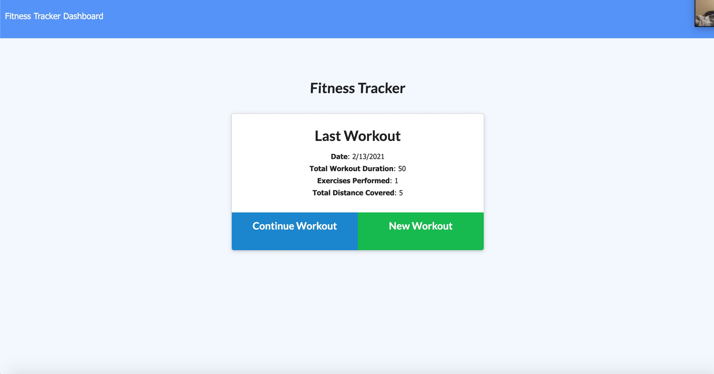
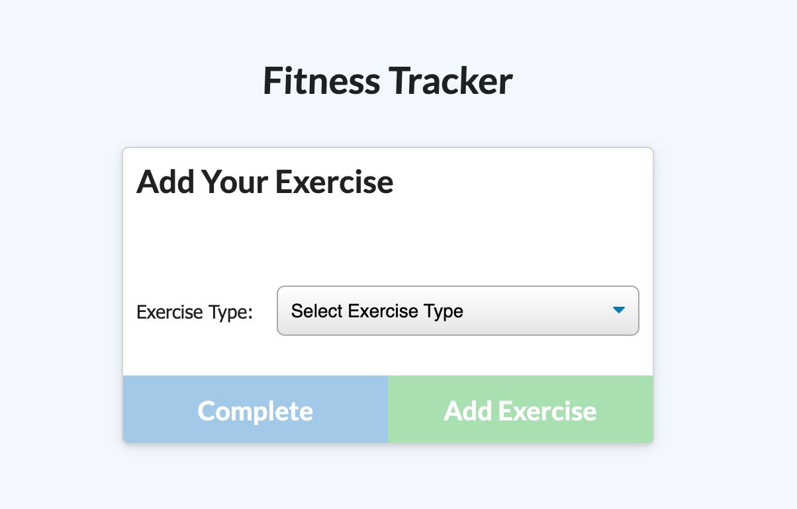
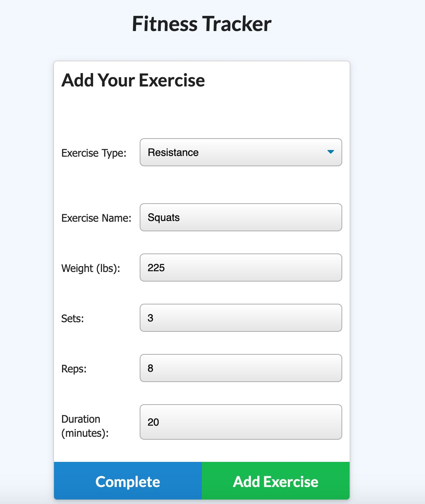
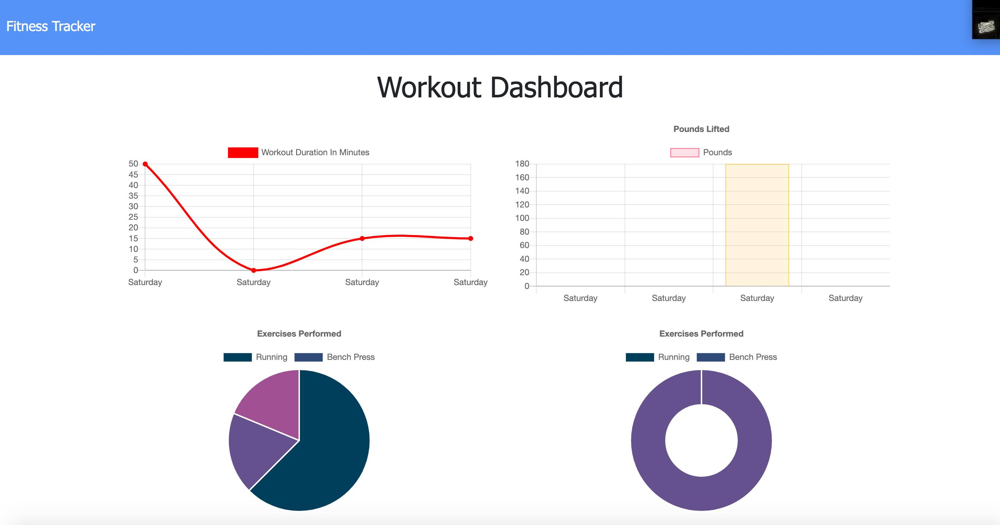

# Fitness Tracker



## Description 
The purpose of this application is to allow the user to log and track workouts.  The user can add new exercises allow with the type of activity, duration, reps, sets, etc.  These workouts are stored and can be view later.  The user can also access a stats page that show details graphs outlining the different information about the types of workouts the user has been doing and when they occured.         

#### Built With
* mongoDB
* Mongoose.js
* Express.js
* Node.js
* html, css, javascript
* Boostrap

#### Technical Overview
This application is built with an express server and use mongoDB for storing user data.  The Express server interacts with the database using mongoose.js.  The charts on the stats page are generated with the chart.js package.  

## Table of Contents
  
* [Installation](#installation)
* [Usage](#usage)
* [Questions](#questions)
  
  
## Installation
### View the Project Live <br>
https://fitness-tracker-1727.herokuapp.com/

### Run the Project Locally
** This project requires node.js and mongoDB to run locally so make sure these are installed on your device.  **

* Step 1: Navigate to the directory you want to store the project. Clone this your repository to your local computer using the command below. 
```bash
git clone https://github.com/Mark-Mulligan/fitnessTracker.git
```

* Step 2: Use the command line to navigate to the directory that you cloned the project.
Example:
```bash
cd directory/projectdirectory
```

* Step 3: Install the npm package dependencies from the package.json file.
```bash
npm install
```

* Step 4: Make sure an instance of mongoDB is running on your local device. <br>
https://docs.mongodb.com/manual/administration/install-community/

* Step 5: Populate the database by running "node seeders/seed.js" while in the project directory   
```bash
node seeders/seed.js
```

* Step 6: While in the project directory, run the program using node using the command below. Open you browser and navigate to localhost:3000 to view the application.
```bash
node server.js
```  

## Usage 

#### Create New Workout

1.  Click the New Workout Button


2.  Select your exercise type



3.  Fill out the required fields



4.  Click 'add exercise' to add the exercise to your workout and continue on to adding another exercise.
5.  Click 'complete workout' if you want this to be the last workout of your exercise.  

#### Dashboard

1.  Click on the dashboard text on the top left to navigate to the stats page.  This will show you information on all your workouts.  



## Questions
[My Github](https://github.com/Mark-Mulligan) || mark.mulligan.jr1@gmail.com

#### How to Contact Me
Feel free to reach out to me if you have any questions about this project.  You can email me using the email listed above or can go to my github page to view my other projects and portfolio.

© Mark Mulligan 2021 All Rights Reserved.